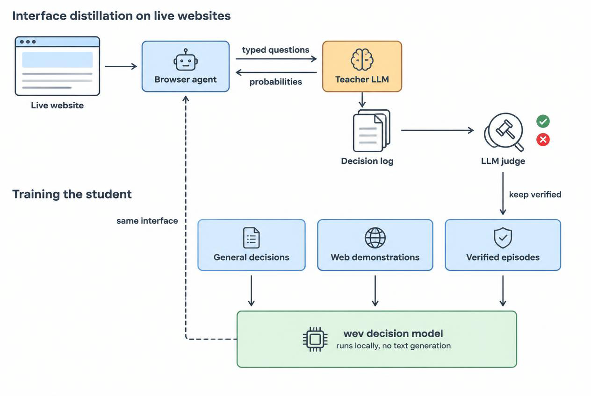
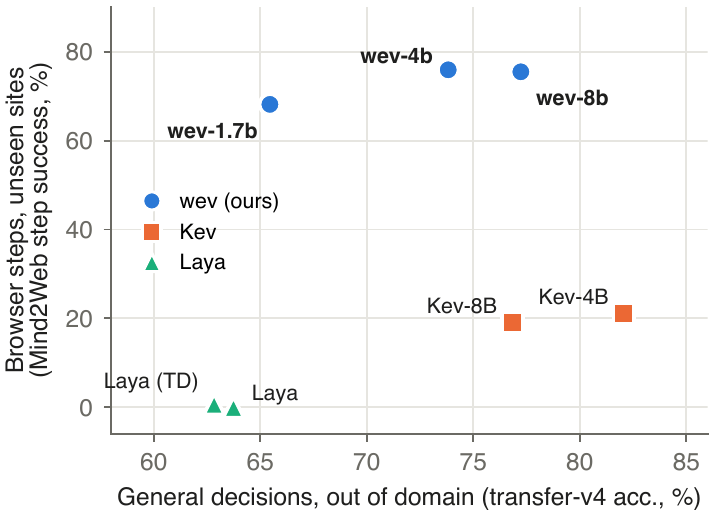
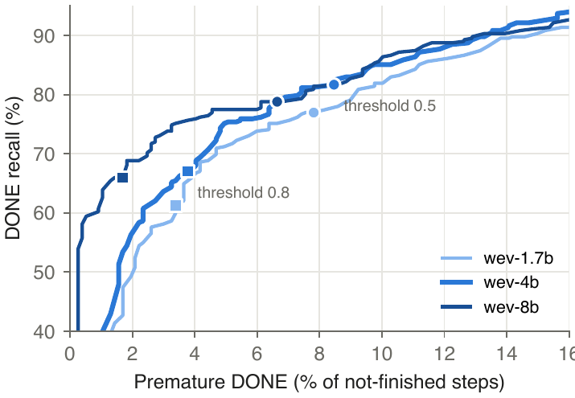

<div align="center">

# wev

**Local System-One decision models for agents.**<br>
Typed questions in, calibrated probabilities out, in one forward pass. No text generation, no API key.

[](https://huggingface.co/collections/alanhuangya/wev-6ab4eb5d872c9ae9fd68faa6)
[](https://huggingface.co/datasets/alanhuangya/wev-data)
[](https://pypi.org/project/wev-ai/)
[](paper/icml/main.pdf)
[](LICENSE)

[Quickstart](#quickstart) · [Results](#results) · [How it works](#how-it-works) · [Train your own](#train-your-own) · [Citation](#citation)

</div>

<p align="center">
  
</p>

`wev` answers the `POST /v1/systemone` request shape: a free-form state plus any number of questions, each a
**choice**, a **yes/no** or a **score**. It handles general decisions such as triage, routing, policy checks and
agent monitoring, and it handles browser-agent steps: *which operation?* and *which element?* It runs on your own
GPU, or on a laptop.

## Highlights

- 🌐 **Browser steps on unseen websites: 76% right**, where open decision models trained on general data reach at
  most 21%.
- 🧠 **General decisions stay strong.** wev beats Laya on every general benchmark, and wev-8b is level with Kev-8B out
  of domain.
- 🎓 **As good as its teacher, locally.** As the System One of an open browser agent, wev completes as many live
  tasks as the LLM it was distilled from.
- ⚡ **Fast.** 10–37 ms for a general decision and 91–322 ms for a full browser page on one RTX 5090; 77 ms on a
  laptop.
- 📏 **Calibrated.** Probabilities you can threshold: raise the bar for DONE and early stops drop from 8.5% to 3.8%.

## Models

| Model | Size | Best for | General decision | Browser step |
|---|---|---|---|---|
| [**wev-4b**](https://huggingface.co/alanhuangya/wev-4b) | 8.1 GB | the default: one consumer GPU, best on live websites | 15 ms | 217 ms |
| [wev-8b](https://huggingface.co/alanhuangya/wev-8b) | 15.2 GB | the most accurate out of domain | 21 ms | 322 ms |
| [wev-1.7b](https://huggingface.co/alanhuangya/wev-1.7b) | 3.5 GB | laptops and small GPUs; the fastest | 10 ms | 91 ms |

*Median latency on one RTX 5090 (bf16), one request at a time.*

## Quickstart

```bash
pip install "wev-ai[serve]"
```

```python
import wev

m = wev.load("alanhuangya/wev-4b")   # downloads once from the Hugging Face Hub
out = m.predict(
    state="Refund request: order #4411 arrived damaged, customer attached photos, first refund this year.",
    questions={
        "action": {"type": "choice", "instructions": "What should support do?",
                   "criteria": {"refund": "Refund the order.", "replace": "Ship a replacement.",
                                "escalate": "Send to a human agent."}},
        "fraud_risk": {"type": "noul", "instructions": "This request looks fraudulent.",
                       "criteria": {"true": "Likely fraud.", "false": "No sign of fraud."}},
    },
)
out["answers"]
# {'action': {'type': 'choice', 'choice': 'replace', 'probabilities': {'refund': 0.38, 'replace': 0.51, ...}},
#  'fraud_risk': {'type': 'noul', 'noul': 0.02}}
```

**Serve it over HTTP** with the same request and response shapes as a System One API:

```bash
wev serve --model alanhuangya/wev-4b --port 8009
curl -s localhost:8009/v1/systemone -H 'content-type: application/json' -d '{"state": "...", "questions": {...}}'
```

**Use it in a browser agent.** An agent written for a System One API, such as
[jev-ultrafast](https://github.com/browser-use/jev-ultrafast), can call `http://127.0.0.1:8009/v1/systemone`
instead of the hosted endpoint. jev-ultrafast hard-codes that URL in `jev_ultrafast/model.py` (`SYSTEM_ONE_URL`), so
change that one line.

## Results

<p align="center"></p>

Every model below receives the same requests and is scored the same way: per-question accuracy, with each model's
most probable option taken as its answer. All numbers are on held-out test splits.

**General typed decisions**

| Model | Kev decision-v7 | Kev transfer-v4 | typed-decisions |
|---|:---:|:---:|:---:|
| **wev-8b** | 82.4 | 77.2 | 79.1 |
| **wev-4b** | 80.6 | 73.8 | 79.4 |
| **wev-1.7b** | 81.1 | 65.5 | **79.5** |
| Kev-4B | **88.2** | **82.1** | 65.1 |
| Kev-8B | 88.1 | 76.8 | 62.7 |
| Laya (typed-decisions) | 65.7 | 62.8 | 76.8 |
| Laya | 64.3 | 63.7 | 36.2 |

**Browser steps.** Mind2Web test split: 873 requests on websites unseen in training. A step counts when both the
operation and the target element are right.

| Model | Step success | Operation |
|---|:---:|:---:|
| **wev-4b** | **75.9** | **91.2** |
| **wev-8b** | 75.5 | 90.3 |
| **wev-1.7b** | 68.2 | 88.1 |
| Kev-4B | 21.2 | 35.7 |
| Kev-8B | 19.0 | 73.3 |
| Laya (typed-decisions) | 0.7 | 13.1 |
| Laya | 0.0 | 2.5 |

**End to end on live websites.** jev-ultrafast ran 153 held-out tasks with each model as its System One. A task
succeeds when the agent says DONE and an LLM judge, reading the final page, agrees.

| System One | Tasks completed |
|---|:---:|
| wev-4b | 30 / 153 |
| wev-8b | 28 / 153 |
| qwen3-max, prompted (the teacher) | 27 / 153 |

<details>
<summary><b>Notes on the comparison</b></summary>

- *Kev decision-v7* is Kev's own training suite; wev also trains on its train split, and Kev leads there by 6–8
  points. *Kev transfer-v4* is out of domain for every model in the table.
- wev and Laya (typed-decisions) train on 80% of the typed-decisions train split; Kev and plain Laya do not, so on
  that column they are generalists.
- Kev and Laya ran as published, without web training data. wev is evaluated with a 4,096-token state; the 11
  Mind2Web requests beyond it count as wrong for wev.
- Live sites change from run to run, so treat end-to-end gaps of a few tasks as noise. wev-4b's gain from its second
  teacher collection held on a paired comparison (10 tasks gained, 1 lost).
- Test splits were held out from training and model selection, with one exception: wev-4b and wev-8b each had two
  candidates, and both were read on test.
- Raw results are in [`results/`](results).

</details>

<details>
<summary><b>Calibration: choosing when to stop</b></summary>

<p align="center"></p>

The hardest browser decision is when to stop. Accepting DONE only above a probability threshold trades missed stops
for early ones: at 0.8, wev-4b stops early on 3.8% of unfinished steps (8.5% at 0.5), and wev-8b on 1.7%.

</details>

## How it works

**Interface distillation.** An agent talks to its System One through typed requests. We serve a prompted LLM behind
that interface while the agent works on live websites, so every logged request and answer is already a training
example in the decision model's own format. An LLM judge reads each episode's final page and keeps only the episodes
whose outcome it confirms. It rejected 36% of the teacher's own DONE claims.

**Data.** We combine those episodes with Mind2Web and NNetNav steps converted to the same request format, and with
general typed-decision corpora. An LLM-judge audit of NNetNav's stopping labels overturned 31% of its DONE labels.

**Model.** A Qwen3 base model with its vocabulary head removed, adapted with LoRA and merged into the released
weights. Each question sees the state and itself only, so one forward pass answers every question in a request, and
question order never changes an answer. A pointer head scores each option against the question and normalises the
scores into probabilities.

```
<state> page text · elements · recent actions
<q> which operation? <opt> CLICK </opt> <opt> TYPE_TEXT </opt> … <opt> DONE </opt> <decide>
<q> which element to CLICK? <opt> [1] Search </opt> <opt> [2] Sign in </opt> … <decide>
```

The [paper](paper/icml/main.pdf) has the full method, ablations and failure analysis.

## Train your own

<details>
<summary><b>Data, training, evaluation and export commands</b></summary>

```bash
pip install -e ".[train,serve,dev]"

# data
python -m wev.mind2web --out data/m2w-v2 --dev_frac 0.15 --test_frac 0.1
python -m wev.nnetnav  --out data/nnetnav-v2
python -m wev.general  --out data/general --kev_repo path/to/kev
python -m wev.external --out data/ext
# DONE relabelling of NNetNav by an LLM judge (OpenAI-compatible endpoint from WEV_JUDGE_BASE_URL / _API_KEY / _MODEL)
python scripts/judge_done.py --data data/nnetnav-v2/train.jsonl --out judge-train.jsonl
python scripts/apply_judge.py --data data/nnetnav-v2 --judge 'judge-{split}.jsonl' --out data/nnetnav-v3-clean

# the wev-4b recipe; dir:K repeats a training file K times. One GPU works too: drop torchrun.
# wev-8b and wev-1.7b use the same mix without data/teacher-v2.
torchrun --nproc_per_node 8 -m wev.train --base Qwen/Qwen3-4B-Base --head pointer --lr 1e-4 --epochs 1 \
  --batch_tokens 6000 --accum 1 --checkpointing 0 --out runs/wev-4b \
  --data data/m2w-v2,data/nnetnav-v3-clean,data/teacher-v1:3,data/teacher-v2:3,data/general/kev-v7:2,data/general/typed-decisions-train:8,data/ext/tasksource-jev,data/ext/jev-distill,data/ext/td-synth

wev evaluate --model runs/wev-4b --data data/general/kev-transfer-v4 --split dev
wev export --run runs/wev-4b --out exports/wev-4b --check data/general/typed-decisions/dev.jsonl
pytest -q tests
```

The converted browser data and both teacher collections are on the Hub as
[`alanhuangya/wev-data`](https://huggingface.co/datasets/alanhuangya/wev-data); `validation.jsonl` is read as the
development split. To collect new teacher episodes, use `scripts/teacher_server.py`, `make_tasks.py`, `collect.py`
and `build_teacher_data.py`.

</details>

<details>
<summary><b>Training data and licenses</b></summary>

| Source | License | What it adds |
|---|---|---|
| [Mind2Web](https://huggingface.co/datasets/osunlp/Mind2Web) | CC BY 4.0 | human browser steps (click, type, select), split by website |
| [NNetNav-live](https://huggingface.co/datasets/stanfordnlp/nnetnav-live) | Apache-2.0 | live-web steps; DONE relabelled by an LLM judge |
| teacher episodes | outputs of qwen3-max | jev-ultrafast on live sites with qwen3-max as System One; judge-verified |
| [Kev decision-v7](https://github.com/jaredpalmer/kev) | per source | ten public classification and QA sources plus rule-composition records |
| [typed-decisions](https://huggingface.co/datasets/LocalLLaMA/typed-decisions) | Apache-2.0 | agent and ops workflows (80% of its train split) |
| [tasksource-jev](https://huggingface.co/datasets/tasksource/tasksource-jev) | mixed, per source task | hundreds of classification tasks recast as decisions |
| [jev-distill-corpus-v3](https://huggingface.co/datasets/SargeDev/jev-distill-corpus-v3) | Apache-2.0 | synthetic operational scenarios with soft labels |
| [typed-decisions-synth](https://huggingface.co/datasets/n4ze3m/typed-decisions-synth) | MIT | multi-question cases over 149 domains |

**Use terms.** The weights are released under Apache-2.0, but some training data carries its own terms: several
tasksource-jev source tasks are licensed for research only, and the teacher episodes are outputs of qwen3-max,
subject to its provider's terms. Treat the models as research artifacts and check those terms before commercial use.

</details>

## Limitations

- English only. wev makes decisions and does not write text; in jev-ultrafast, typed values come from its separate
  text model.
- Browser targets are scored among the candidates the agent lists (8–40 per step), not every element on the page, so
  the numbers are not comparable to the Mind2Web leaderboard.
- Rare operations are rarely predicted: BLOCKED and scrolling have low recall. On NNetNav, wev-4b says DONE too early
  on 8–10% of steps unless you threshold it.
- On Kev's own suite, Kev is more accurate.
- wev has not been compared with Jev itself, because we have no API access.

## Citation

Jun Huang and Xin Ren contributed equally (University of Electronic Science and Technology of China).

```bibtex
@misc{huang2026wev,
  title  = {wev: Distilling LLM Browser Agents into Open, Local System-One Decision Models},
  author = {Huang, Jun and Ren, Xin},
  year   = {2026},
  url    = {https://github.com/alanhuangyoo/wev}
}
```

## Acknowledgements and license

Apache-2.0. The model code builds on [kev](https://github.com/jaredpalmer/kev) (Apache-2.0) and uses instruction text
from [jev-ultrafast](https://github.com/browser-use/jev-ultrafast) (MIT); the models build on Qwen3 base models
(Apache-2.0). wev is an independent project, not affiliated with TypeSafe AI, and does not use Jev. See
[NOTICE](NOTICE).
